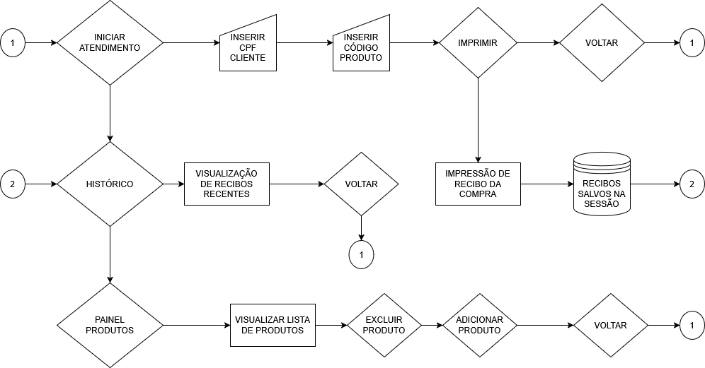

# CestaDigital

## EUA 🗽
CestaDigital is a computer software designed to assist in the sale of products for small food businesses. Intended for point-of-sale operations, this system allows users to add and remove products as needed and identify them via code. In addition to printing a receipt with sales information, it's possible to view previous sales in the user session.

# BR ⚽
CestaDigital é um software de computador que possui como objetivo auxiliar na realização da venda de produtos para pequenos comércios de alimento,
destinado para venda em caixa, este sistema possibilita adicionar e excluir produtos conforme demanda e identificá-los via código. Além de imprimir um recibo com as informações da venda realizada, torna-se possível visualizar vendas anteriores na sessão de uso.

# Summary
Software PDV destinado para a venda de produtos de mercado.

## 🚀 Funcionalidades
- Cadastro de produtos
- Exclusão de produtos
- Carrinho de compras
- Impressão de recibo
- Histórico de recibos

## 🖥️ Preview

  
  
  

## 📝 Fluxograma
  

## 🛠️ Tecnologias
- JavaScript
- HTML5
- CSS3
- Electron
- NodeJS

## 📦 Como rodar
Em seu computador, execute o Xampp ou WampServer para rodar o Apache e MySql, importe o banco de dados `mercado.sql` na pasta bd.
Execute o arquivo `server.js` em seu editor de código e no terminal digite o caminho da pasta Software-CestaDigital com `cd`.
Após isso o ambiente estará pronto, digite npm start no terminal e o software será executado.

- Caso não desejar utilizar o electron, execute o "index.html", e o software será executado na web
