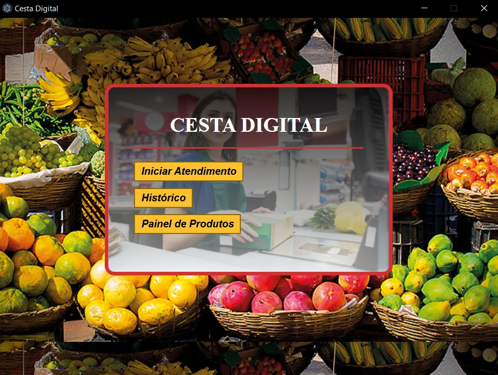
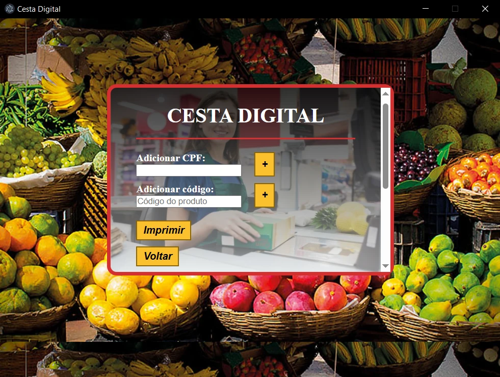
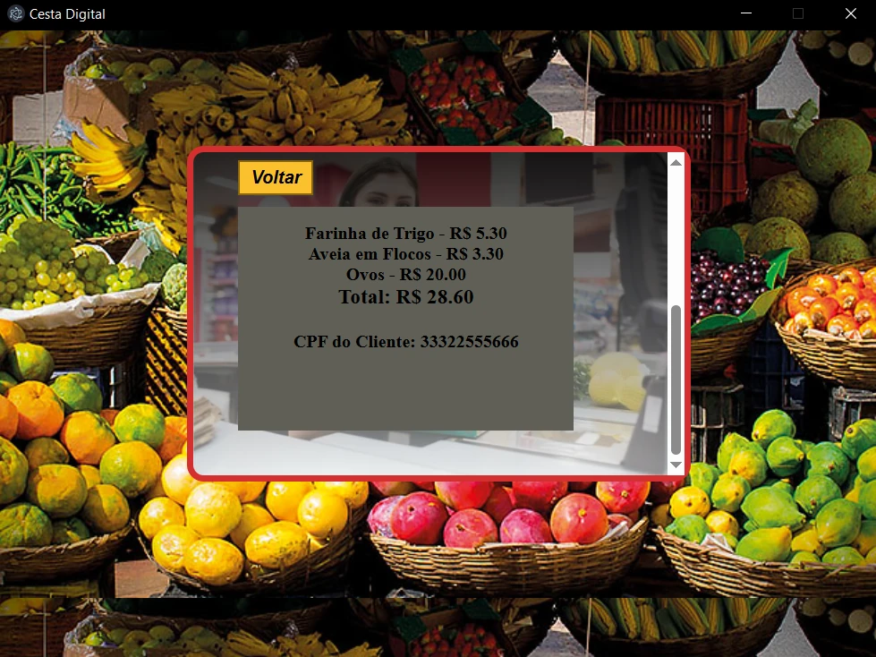

# Software-CestaDigital
Software PDV destinado para a venda de produtos de mercado.

## 🚀 Funcionalidades
- Cadastro de produtos
- Carrinho de compras
- Impressão de cupom

## 🖥️ Preview

  
  
  

## 🛠️ Tecnologias
- JavaScript
- HTML5
- CSS3
- Electron
- NodeJS

## 📦 Como rodar
Em seu computador, execute o Xampp ou WampServer para rodar o Apache e MySql, importe o banco de dados `mercado.sql` na pasta bd dentro de public.
Execute o arquivo `server.js` em seu editor de código e no terminal digite o caminho da pasta Software-CestaDigital com `cd`.
Após isso o ambiente estará pronto, digite npm start no terminal e o software será executado.

- Caso não desejar utilizar o electron, execute o "index.html", e o software será executado na web
